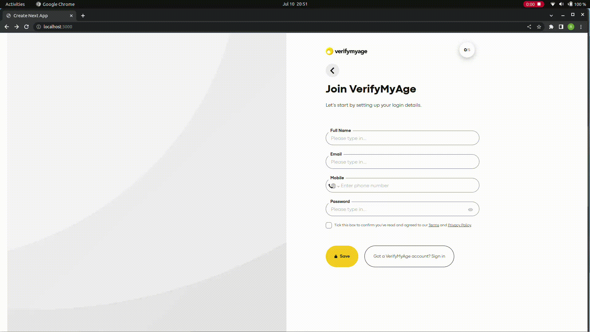

This is a [Next.js](https://nextjs.org/) project bootstrapped with [`create-next-app`](https://github.com/vercel/next.js/tree/canary/packages/create-next-app).

## Getting Started

First, install the project dependencies:

```bash
npm install
```

Second, run the development server:

```bash
npm run dev
```

Open [http://localhost:3000](http://localhost:3000) with your browser to see the result.


## Preview

### Mobile


### Desktop



## Important

To mimic form validation, I applied the following rules:

* Full name needs to have at least two names.

* Email should be in correct format.

* Mobile number should not be empty.

* Password should have at least 4 characters.

* Checkbox needs to be checked.

- The save button will only be enable if all the input validations pass.

- You can follow the validation steps from the progres component in the top right corner.


